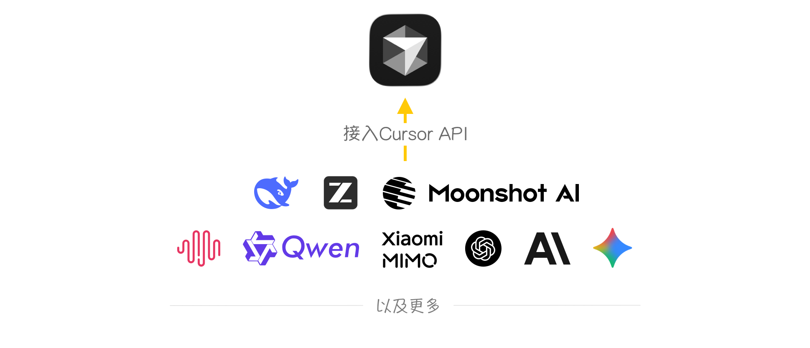
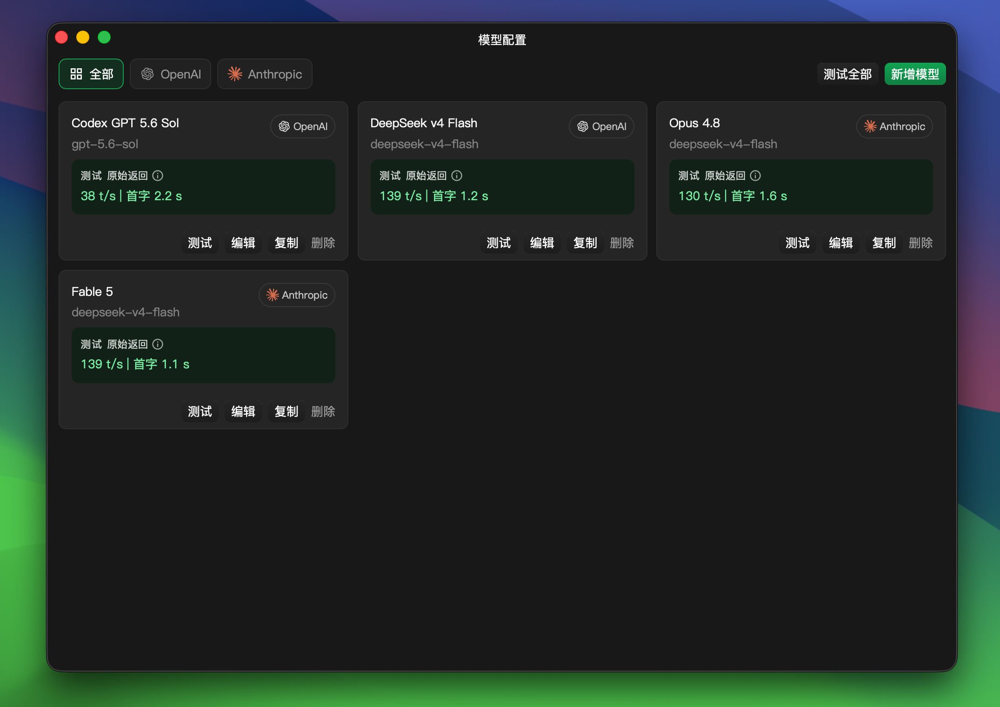

<div align="center">

# cursor-byok

cursor-byok 是 Cursor 后端的本地实现。
<br>
<br>
<a href="https://trendshift.io/repositories/39260?utm_source=repository-badge&amp;utm_medium=badge&amp;utm_campaign=badge-repository-39260" target="_blank" rel="noopener noreferrer"></a>

[使用教程](https://docs.leokun.cn) · [下载最新版](https://github.com/leookun/cursor-byok/releases/latest) · [问题反馈](https://github.com/leookun/cursor-byok/issues) · [English](./README.md)

[](https://github.com/leookun/cursor-byok/releases/latest)
[](https://github.com/leookun/cursor-byok/releases)
[](./LICENSE)
[](https://github.com/leookun/cursor-byok/releases/latest)

</div>




## 项目介绍

cursor-byok 是一个开源的 Cursor 本地模型接入工具。它通过运行在本机的服务连接 Cursor 与你配置的模型 API，让模型请求使用自己的渠道处理，同时保留 Cursor Agent 的工具调用、Skills 和 MCP 等能力。

你可以接入 OpenAI、Anthropic 及其兼容服务，自由配置接口地址、模型、密钥和请求参数，不再局限于平台预设的模型渠道。

> [!IMPORTANT]
> cursor-byok 本身免费开源，但你接入的模型 API 可能由对应服务商收费。本项目不是 Cursor 官方产品，与 Cursor 或其开发公司无隶属关系。

## 核心能力

- **自定义模型渠道**：配置自己的 API 地址、访问密钥和模型标识。
- **多种接口协议**：支持 OpenAI、Anthropic 兼容接口及自定义端点。
- **模型管理**：添加、复制、编辑、排序和批量测试多个模型配置。
- **连接性能测试**：查看首字延迟、生成速度与模型服务的原始响应。
- **Agent 工作流**：支持工具调用、Skills、MCP 和多轮会话。
- **会话统计**：查看 Token 消耗、缓存命中率、对话轮次和价值估算。
- **跨平台运行**：支持 macOS、Windows 和 Linux。

## 快速开始

1. 从 [GitHub Releases](https://github.com/leookun/cursor-byok/releases/latest) 下载对应平台的最新版本。
2. 启动 cursor-byok，打开“模型配置”，填写接口地址、API Key 和模型标识。
3. 测试模型配置；测试通过后返回主界面启动服务。
4. 打开 Cursor，选择已配置的模型并开始使用 Agent。

更完整的安装、系统配置和常见问题说明，请查看 [详细使用教程](https://docs.leokun.cn)。

## 模型管理

模型配置支持 OpenAI 与 Anthropic 两类接口协议。每个模型渠道可以独立设置上下文窗口、最大输出 Token、推理强度、自定义请求头和额外请求参数。



## 工作原理

```text
Cursor 客户端
    │
    │ Agent 请求与工具结果
    ▼
cursor-byok 本地服务
    │
    │ OpenAI / Anthropic 兼容请求
    ▼
你配置的模型 API
```

cursor-byok 在本机负责协议适配、模型请求转发、工具调用衔接与会话状态管理。模型 API Key 和应用配置保存在本机；实际请求仍会发送到你所配置的模型服务商。

## 为什么做这个项目

很多 Agent 产品会将工具能力、模型选择、订阅方案和计费方式绑定在一起，用户只能使用平台提供的模型渠道。

我希望将模型选择权交还给用户：开发者可以充分利用已有的模型 API 和额度，自由选择适合自己的模型与服务商，也可以在需要时自托管相关服务。

## 路线图

项目将继续改进模型兼容性、Agent 工具链、本地运行稳定性和自托管体验，并探索更多 IDE、Chat 与 Agent 场景。

详细计划与进展请查看 [正式版路线图](https://github.com/leookun/cursor-byok/discussions/32)。

## 社区与支持

- [使用教程](https://docs.leokun.cn)
- [GitHub Issues](https://github.com/leookun/cursor-byok/issues)
- [Telegram 交流群](https://t.me/cursor_byok)
- QQ 交流群：`1095916242`、`1094411438`、`1095918002`、`1094419321`


## 开发与贡献

欢迎提交 Issue 和 Pull Request。开发环境、构建命令、项目结构及提交规范请阅读 [贡献指南](./CONTRIBUTING.md)。


## 贡献者名单

<a href="https://github.com/leookun/cursor-byok/graphs/contributors">
  
</a>


## 许可证

本项目基于 [MIT License](./LICENSE) 开源。
